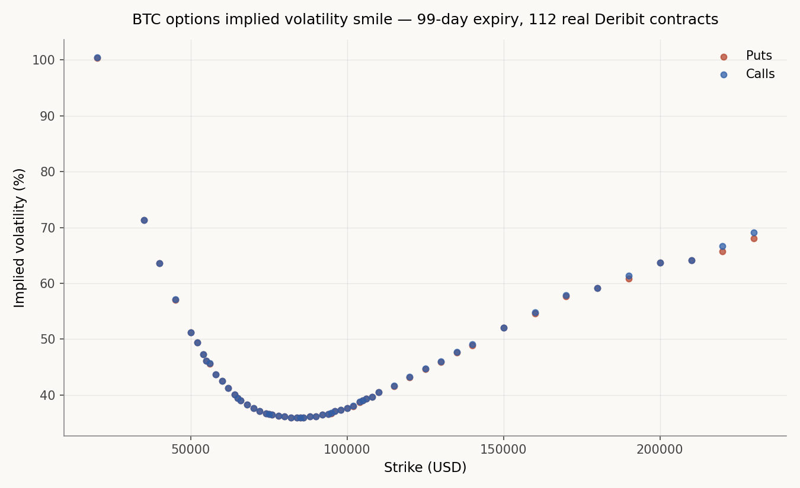

# deriv-engine

A C++20 derivatives pricing engine for Bitcoin options, built from
scratch: closed-form pricing, numerical methods, Monte Carlo
simulation, hand-built automatic differentiation, a Heston
stochastic-volatility model, and calibration against live market
data — validated against a real exchange, not just textbook values.

[](https://github.com/roberto0607/deriv-engine/actions)

## Live demo

**[roberto0607.github.io/deriv-engine](https://roberto0607.github.io/deriv-engine/)**
— the actual C++ (Black-Scholes, binomial tree, Monte Carlo, Heston,
plus a dedicated card for Asian and Barrier options) compiled to
WebAssembly via Emscripten and run directly in the browser. Every
number on that page comes out of the real compiled engine, not a JS
reimplementation, and the Heston card's kappa/xi/rho are calibrated
against the real Deribit chain by CI on every push (see
`tools/calibrate_heston.cpp`), not hand-typed. The exotics card goes a
step further and runs its own validation checks (closed form, in/out
parity) live in the browser, not just a price.

## Headline result

Pulled the full live BTC options chain from Deribit (904 real
contracts) and independently solved implied volatility for every one,
using nothing but this engine's own Black-Scholes implementation and a
hand-built Newton-Raphson solver — no reference to Deribit's own
reported values during solving.

**Result: 96.8% convergence, a median gap of 0.3 percentage points
from Deribit's own reported implied volatility across the entire
chain** (mean gap 2.2pp — pulled up by a thin tail of near-expiry and
far-out-of-the-money contracts where Deribit's own quoted IV is likely
thin or stale to begin with; 90% of contracts land within 5.6pp — see
`docs/phase-log.md` for the full breakdown).

The resulting volatility smile, plotted directly from real market
prices (99-day expiry, 112 converged contracts):



Implied vol bottoms out in the mid-30s% near the money and rises on
both wings — over 100% for the deepest out-of-the-money puts, into the
high 60s% for the deepest out-of-the-money calls — the same skew this
engine's Heston model is calibrated to reproduce.

## What's implemented

| Method | What it proves | Validated against |
|---|---|---|
| Black-Scholes closed-form | Exact European pricing + analytical Greeks | Textbook reference values, put-call parity |
| Binomial tree | American early exercise | Converges to Black-Scholes as steps→∞ |
| Trinomial tree | A second, independently-derived lattice (3 branches/node instead of 2) | Agrees with the binomial tree at high step counts; measured (not assumed) ~5-10% lower error at equal step counts |
| Monte Carlo | Simulation-based pricing, variance reduction | Converges to Black-Scholes; antithetic + control variates give a measured 6.97x variance reduction |
| Reverse-mode AAD | Hand-built automatic differentiation | Matches analytical Greeks; benchmarked against bump-and-revalue |
| Second-order AAD (gamma) | Forward-over-reverse AD (a second, independent tape) for gamma, not finite differences | Matches analytical Black-Scholes gamma to ~1e-9 on a smooth pricing formula; honestly documented failure mode on Monte Carlo's kinked payoff (see below) |
| Delta-hedging simulation | Realized P&L vs. theoretical price | Mean PnL ≈ 0 across 2000 simulated paths; hedging error shrinks ~4.5x from monthly to daily rebalancing |
| Longstaff-Schwartz | American option pricing via Monte Carlo | Converges to the binomial tree on two independent parameter sets |
| Crank-Nicolson PDE | Direct numerical solution of the Black-Scholes PDE | Converges to Black-Scholes; explicit-scheme instability demonstrated directly (diverges to -10^22 under the same conditions CN stays accurate) |
| Implied vol + calibration | Real market data, not synthetic inputs | See headline result above |
| Heston stochastic volatility | Closed-form pricing via the COS method (Fang & Oosterlee), capturing volatility skew a flat-vol model can't | Collapses to Black-Scholes in the deterministic-variance limit; independently cross-checked against a full Monte Carlo simulation of the Heston SDE; kappa/xi/rho calibrated (Nelder-Mead, regularized) against 66 real Deribit contracts, fitting the smile to 0.43pp RMSE in vol space |
| Asian options (path-dependent MC) | Full-path GBM simulation, not terminal-jump sampling | Geometric-average variant matches its Kemna-Vorst closed form; arithmetic ≥ geometric (AM-GM, provable pathwise); Asian < vanilla European; single-monitoring-date edge case matches vanilla Monte Carlo exactly |
| Barrier options (path-dependent MC) | All 4 knock-in/knock-out directions | Down-and-out call matches a method-of-images closed form; the other 3 directions validated via the model-independent in/out parity identity (knock-out + knock-in = vanilla) |
| Bates model (Heston + Merton jumps) | Adds discontinuous jumps on top of Heston's diffusion — a jump-diffusion closed-form via the COS method, reusing Heston's own characteristic function rather than re-deriving it | Collapses exactly to Heston when jump intensity is zero; collapses to closed-form Merton (1976) jump-diffusion in the deterministic-variance limit; independently cross-checked against a full Monte Carlo simulation of the actual Bates SDE + jump process |
| Historical delta-hedging backtest | Do Black-Scholes/Heston/Bates hedge ratios track *real* BTC price history, day by day — not just synthetic Monte Carlo paths | Rolling 30-day at-the-money calls, delta-hedged daily against 16 years of real BTC price history (2010-2026, 195 windows): Bates (jump-aware) shows both the highest mean hedge P&L (+225.8bps) and the lowest variance (430.7bps) of the three models, consistent whether measured over the full history or restricted to 2016+ (Deribit's own era) |
| Portfolio-level VaR and stress testing | Cross-validates two genuinely independent risk methods against each other, and exposes the classic blind spot of the naive one | On a short-gamma example book: real historical simulation and Monte Carlo (Bates SDE) VaR agree within ~2.3x at the 99% level (9.9k vs. 6.8k at 95%, 37.8k vs. 16.3k at 99%); delta-normal VaR — the fast textbook approximation — misses badly at 99% (3.95k, roughly a tenth of what the two repricing-based methods find) because it can't see the book's gamma. Stress-tested against 3 real historical crashes (COVID, FTX collapse, the full 2021-2022 bear market) |

Every method above independently arrives at the same price for the
same European option — four structurally different approaches
(formula, tree, simulation, PDE) agreeing is the core correctness
evidence for this engine.

## Notable engineering details

- **Every bug found is documented, not hidden.** Real bugs were found
  and fixed during development, each with a before/after test proving
  the fix — a division-by-zero at T=0, a double-counted premium in the
  hedging PnL calculation, a random-seed mismatch that corrupted a
  finite-difference comparison, and a catastrophic-cancellation bug in
  the Heston characteristic function that caused an 82% pricing error
  for far-out-of-the-money options, and a discount-rate bug in an
  independent Merton jump-diffusion test oracle (not in the pricer
  itself) found by cross-checking against a 20-million-path direct
  Monte Carlo simulation until the real disagreement was pinned down.
  See `docs/phase-log.md`.
- **AAD was benchmarked honestly, not just claimed to be fast.**
  At the tested scale (4 Greeks, 100k paths), hand-built reverse-mode
  AAD was measured to be *slower* than naive bump-and-revalue — the
  reasoning for why, and where the actual crossover point is, is
  documented in `docs/numerics.md` rather than glossed over.
- **Deliberate scope decisions, not gaps.** Discrete dividends remain
  out of scope, with the reasoning written down in `docs/numerics.md`.
  Trinomial trees, second-order AAD (gamma), and exotic payoffs (Asian,
  Barrier) were deferred the same way at first, then revisited and built
  (see the rows above) once the higher-priority phases were done —
  Asian/Barrier pricing has its own card in the live demo, running its
  validation checks (closed form, in/out parity) live in the browser
  (see `docs/phase-log.md` Phase 13).
- **Gamma via AAD works on a smooth pricing formula, and honestly
  doesn't on Monte Carlo.** Forward-over-reverse AD recovers Black-
  Scholes gamma to ~1e-9 when applied to the closed-form formula. The
  exact same technique applied to a Monte Carlo path's payoff gives
  gamma = 0, every time — not a bug, but the well-known consequence of
  differentiating a piecewise-linear (kinked) payoff twice: its second
  derivative is a.e. zero except exactly at the kink, which has
  probability zero of being sampled. A working Monte Carlo gamma
  estimator needs a different technique entirely (e.g. the likelihood-
  ratio method) — documented, not silently worked around. See
  `docs/phase-log.md` Phase 11.
- **Heston calibration is honest about non-identifiability — and about
  what actually fixes it.** kappa and theta aren't separately
  identifiable from a single expiry's smile — an unregularized fit
  converges to a valid but implausible parameter set. Real-data
  calibration uses a small L2 penalty toward a reasonable initial guess
  to resolve this; the synthetic parameter-recovery test deliberately
  doesn't, so its accuracy assertions stay meaningful. The actual fix —
  calibrating jointly across multiple expiries instead of regularizing
  a single one — is measured directly: on synthetic data it recovers
  all 5 parameters to floating-point precision from a deliberately bad
  guess; on the real chain it exposes that constant-parameter Heston
  genuinely can't fit several real maturities as tightly as it fits one
  (1.35pp RMSE pooling 2 expiries vs. 0.43pp on a single expiry) — a
  real, documented limitation, not swept under the regularizer. See
  `include/deriv-engine/heston_calibration.hpp` and `docs/numerics.md`
  Phase 12.
- **Reproducible market data.** Live data is pulled once and frozen
  to a snapshot (`data/btc_chain_snapshot.json`) rather than tests
  depending on a live API call, keeping the test suite deterministic.
- **A backtest, scoped honestly to what real data actually supports.**
  No free historical BTC *options* data source exists, so the Phase 15
  backtest tests pricing/hedging accuracy against 16 years of real BTC
  *spot* price history instead of an invented trading strategy — a
  deliberately narrower, more defensible claim than a strategy backtest
  would be, with every input's provenance (a public GitHub price
  dataset, spot-checked against 4 known price points) and every honest
  limitation (no historical implied vol, jump parameters from a simple
  threshold heuristic) written down in `docs/phase-log.md` Phase 15.
- **VaR cross-validated the same way every model in this project has
  been.** Rather than trust one risk number, Phase 16 computes portfolio
  VaR two genuinely independent ways — replaying real historical returns,
  and simulating forward under the calibrated Bates SDE — and checks
  they agree, the same "two methods that share no code" discipline used
  for Heston (COS vs. Monte Carlo) and Bates (COS vs. SDE simulation) in
  every earlier phase. A third, textbook delta-normal method is included
  specifically to show what it misses (gamma) on a real options book —
  not held up as a third equally-trustworthy answer.

## Build & test

```bash
git clone https://github.com/roberto0607/deriv-engine.git
cd deriv-engine
cmake -B build -G Ninja -DCMAKE_BUILD_TYPE=Debug
cmake --build build
./build/tests
```

CI runs the same sequence on a clean container on every push — see
the badge above.

## Documentation

- [`docs/design.md`](docs/design.md) — architecture and design decisions
- [`docs/numerics.md`](docs/numerics.md) — the math and numerics behind every method, including edge cases and deliberate scope decisions
- [`docs/phase-log.md`](docs/phase-log.md) — a build log across the project: what was built, how it was validated, and every bug found along the way

## Tech stack

C++20 · CMake · Catch2 · nlohmann/json · Deribit public API · Emscripten/WebAssembly

## Scope

Built around BTC options specifically (continuous dividend yield = 0,
correct for an asset with no dividends) rather than equities. See
`docs/numerics.md` for the reasoning behind this and other scope
decisions.
